# NetCreater v1.07 - программа для создания разверток многогранников из правильных многоугольников

Эта программа предназначена для создания разверток [правильных](https://ru.wikipedia.org/wiki/%D0%9F%D1%80%D0%B0%D0%B2%D0%B8%D0%BB%D1%8C%D0%BD%D1%8B%D0%B9_%D0%BC%D0%BD%D0%BE%D0%B3%D0%BE%D0%B3%D1%80%D0%B0%D0%BD%D0%BD%D0%B8%D0%BA), [полуправильных](https://ru.wikipedia.org/wiki/%D0%9F%D0%BE%D0%BB%D1%83%D0%BF%D1%80%D0%B0%D0%B2%D0%B8%D0%BB%D1%8C%D0%BD%D1%8B%D0%B9_%D0%BC%D0%BD%D0%BE%D0%B3%D0%BE%D0%B3%D1%80%D0%B0%D0%BD%D0%BD%D0%B8%D0%BA) многогранников и [фигур Джонсона](https://en.wikipedia.org/wiki/Johnson_solid), то есть для создания всех фигур, состоящих из правильных многоугольников.

**Развертка** - изображение, которое можно распечатать на бумаге, вырезать, склеить и получить трехмерный многогранник. Развертки создаются в программе путем накладывания одного правильного многоугольника на сторону другого. А так же путем создания особых маленьких фигур, предназначенных для склейки.

При запуске программы вы можете создать файл, введя имя будущего файла
(примечание: расширение `.net` добавляется автоматически к написанному).

Если в свойствах файла формата `.net` задать эту программу как приложение, открывающее его, то при двойном клике на файле этого формата в будущем будет автоматически открываться эта программа, в которую уже загружен этот файл.

Программа позволяет рендерить развертки фигур в настолько большом качестве, насколько вам будет нужно.

Интерфейс программы:

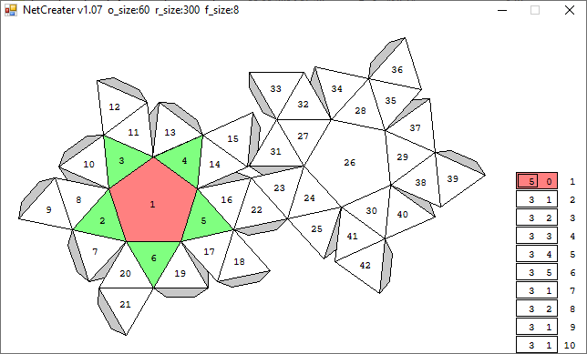

# Скачать

Программа находится в папке `bin`.

Ну или можно скачать прямо по [**этой ссылке.**](https://github.com/optozorax/net-creater/raw/master/bin/NetCreater.exe)

# Управление программой

* `Стрелки` - передвижение по интерфейсу.
* `BackSpace` - удалить текущую фигуру, и всех её потомков.
* `a` - добавить ещё одну фигуру на сторону текущей фигуры.
* `r` - отрендерить текущую фигуру в более хорошем качестве в формате `.bit`.
* `s` - сохранить внесенные изменения.
* `+`/`-` - увеличить/уменьшить значение, на котором вы находитесь на 1.
* `p`/`i` - увеличить/уменьшить значение текущего размера стороны на 5.
* `e`/`t` - увеличить/умньшить значение текущего размера стороны при рендеринге на 5.
* `d`/`g` - увеличить/уменьшить значение текущего размера шрифта на 1.

# Вопрос-ответ

* Как создать место склейки? 
	* Нужно, чтобы в первом столбце текущей фигуры было "-1".(когда будет 3 нажмите "-" ещё раз, чтобы получить "-1")
* Что означают цвета?
	* Красный - цвет текущей фигуры.
	* Желтый - цвет родителя текущей фигуры (цвет фигуры на стороне которой построили).
	* Зеленый - цвет потомков в первом поколении от текущей фигуры (цвет фигур, которые построили на текущей фигуре).
* Что означают столбцы?
	* Первый - количество сторон у текущей фигуры.
	* Второй, на какой стороне, считая от основания, против часовой стрелки, расположена текущая фигура на родителе(основание - это та сторона, на которой построена фигура).
	* Третий - номер фигуры по счету в массиве.
* Что означают числа в центрах нарисованных фигур?
	* Они обозначают номер этой фигуры по счету в массиве.
* Что такое формат `.bit`? 
	* Это наипростейший графический формат, придуманный моим другом Ильёй Шегаем, который можно конвертировать в формат `.bmp` при помощи программы `bin/BMPCreater.exe`, дополнительная информация написана в ней.
	* Используется именно он, так как мне неизвестна кодировка ни одного графического формата, и я самостоятельно не могу создавать обычные изображения, а друг уже написал программу.
	* Программа не работает с файлами, у которых название или директория состоят из русских букв, так что если у вас вылетает ошибка при конвертации, то попробуйте тоже самое сделать в корне жесткого диска.
* В заголовке пишутся ещё какие-то незвестные данные помимо названия, что это?
	* Это размер стороны развертки в режиме реального времени, размер стороны развертки во время рендеринга и размер шрифта соответственно.

# Сделанные фигуры

Программа была создана в первую очередь, потому что в интернете не нашлось альтернатив, а так же для создания изобретенных мною фигур.

## Snub antiprism

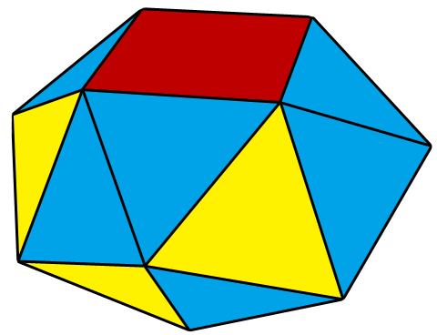

Увидев существование [snub antiprisms](https://en.wikipedia.org/wiki/Johnson_solid#Snub_antiprisms) и ту таблицу, мне сразу стало интересно, возможно ли продолжить эту последовательность, поставив туда 5-угольник, 6-угольник итд. На самом деле можно, большое спасибо магнитному конструктору, который подарил хороший человек по имени Никита Чубко.

Потом по этой фигуре я составил следующую развертку:

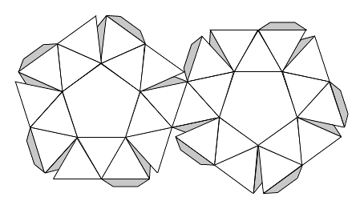

Которая выглядит вот так:

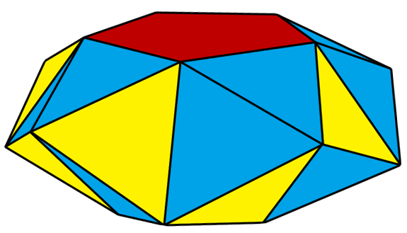

Эту картинку я даже [законтрибьютил](https://commons.wikimedia.org/wiki/File:Snub_Pentagonal_antiprism.png) в википедию :D, но Tomruen её [украл](https://commons.wikimedia.org/wiki/File:Snub_pentagonal_antiprism.png), написав "Own work" 😡.

Примеры других фигур:

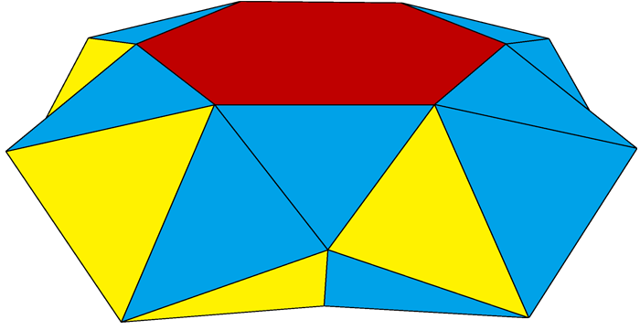

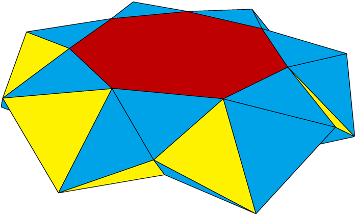

В папке `my_figures/Snub antiprism` находятся развертки всех антипризм от 2 до 7-гранника.

Я не уверен насчет того, не являются ли эти фигуры near-missed. Думаю всё-же нет, но они являются невыпуклыми, поэтому не попали в список фигур Джонсона.

## Snub snub ~~dogg~~ antiprism

Оказалось, что всё это дело можно строить вверх! Вот пример двухслойной snub антипризмы на основе шестиугольника:

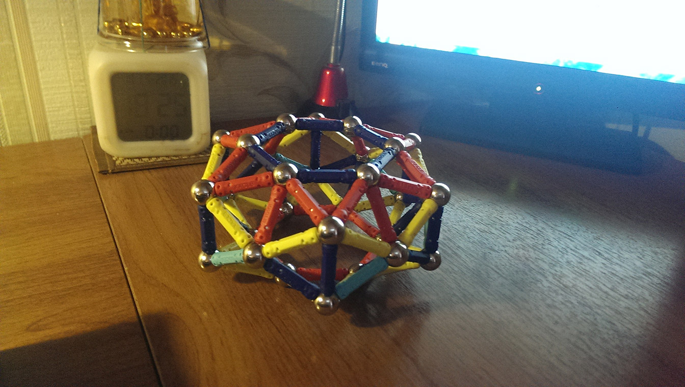

И вообще это может достигать внушительных масштабов!

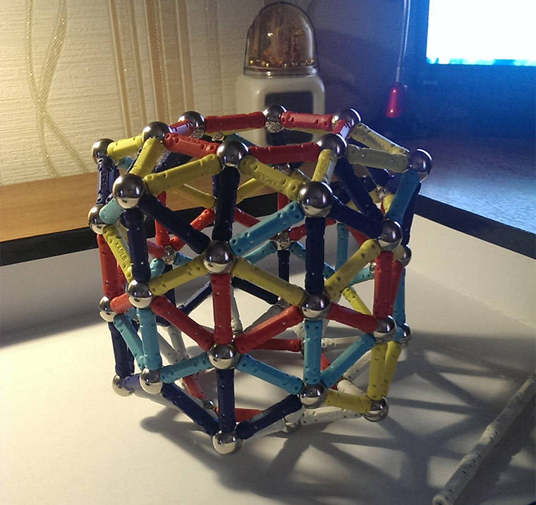

Пример развертки для двухслойной фигуры на основе пятиугольника:

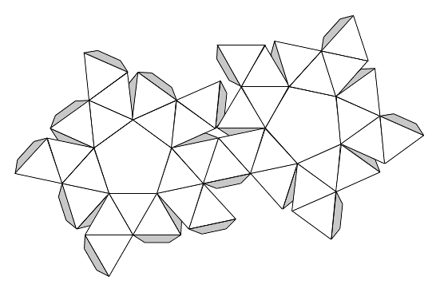

В папке `my_figures/Two-storied snub antiprism` находятся развертки всех двухслойных антипризм от 2 до 7-гранника.

## Near missed

Вдохновленный [курносым кубом](https://ru.wikipedia.org/wiki/%D0%9A%D1%83%D1%80%D0%BD%D0%BE%D1%81%D1%8B%D0%B9_%D0%BA%D1%83%D0%B1), я захотел заменить вверху квадраты на пятиугольники, и вот что получилось:

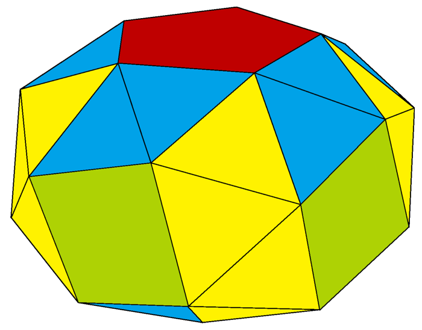

С следующей разверткой:

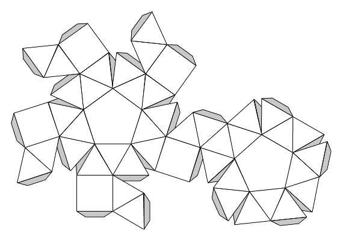

На самом деле эта фигура является [near-miss](https://en.wikipedia.org/wiki/Near-miss_Johnson_solid), что означает, что она может собраться из бумаги, ввиду того, что бумага гнется, но в математическом смысле она не может быть фигурой, потому что чуть-чуть не хватает углов и прочего.

В папке `my_figures/Two-storied snub antiprism` находятся развертки всехэтих фигур от 2 до 7-гранника.

## Остальное? 

Я не стал компилировать картинку к каждой фигуре, потому что это можете сделать вы, скачав программу и нажав кнопку `r`.

Вообще с помощью моей программы можно составить развертки всех многогранников, основанных на правильных многоугольниках, но мне это уже не так интересно. Может быть это захотите сделать вы?

# Разная мета-информация

Данная программа выложена чисто по приколу, дальнейшая разработка не планируется, никому ничем не обязана.

Программа написана на PascalABC, скомпилирована при помощи PascalABC.NET v2.2.0.726.

**Окончательная версия программы:** 22 июня 2015. (мне тогда было 16 лет, лол)

**Лицензия:** WTFPL.

**Автор:** Шепрут Илья.